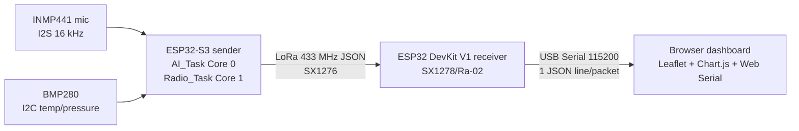

# Forest Sentinel

Forest Sentinel is a LoRa-based environmental monitoring system built around:

- an **ESP32-S3 sender/sensor node** (`sender.ino`) for sensing + on-device audio inference,
- an **ESP32 receiver/base station** (`reciver.ino`) for LoRa intake + serial forwarding,
- a **browser dashboard** (`index.html`) for live situational awareness.

The current firmware and dashboard focus on chainsaw/noise classification with environmental telemetry.

## System architecture



### Data flow (runtime)

1. `sender.ino` samples audio (INMP441, 16 kHz), reads BMP280, runs Edge Impulse (`forest_inferencing.h`), and applies confidence + loudness gates.
2. Sender emits compact JSON over LoRa at **433 MHz**.
3. `reciver.ino` receives the payload, extracts `id` and `s` without a JSON library, computes duplicate flagging, appends radio metadata, and prints one JSON object per line at **115200 baud**.
4. `index.html` reads serial lines, updates node state/cards/map/charts, and ignores packets marked duplicate.

## Component responsibilities

### 1) Sender node (`sender.ino`)

- Board target: **ESP32-S3 DevKitC-1**
- Sensors:
  - INMP441 via I2S (`SAMPLE_RATE 16000`)
  - BMP280 via I2C
- Model runtime: Edge Impulse Arduino SDK (`#include <forest_inferencing.h>` from `impulse.zip` import)
- Core/task split:
  - `AI_Task` pinned to **Core 0**: audio capture, dB estimation, classification, gate logic
  - `Radio_Task` pinned to **Core 1**: BMP polling, packet scheduling, LoRa TX
- Inter-task handoff: one-item FreeRTOS queue (`xQueueCreate(1, ...)`) to keep only freshest inference
- Transmission behavior:
  - **Heartbeat**: idle state (`s=0`) packet every `HEARTBEAT_INTERVAL_MS` (20 s)
  - **Alert burst**: alert state (`s=1`) up to `ALERT_BURST_COUNT` packets every `ALERT_INTERVAL_MS` (5 s)
- Chainsaw alert gate requires all of:
  - top label is `chainsaw`
  - confidence `>= CONFIDENCE_THRESHOLD` (0.85)
  - loudness `>= LOUDNESS_GATE_DB` (65 dB)

### 2) Receiver/base station (`reciver.ino`)

- Board target: **ESP32 DevKit V1**
- Radio module: **SX1278 / Ra-02** (3.3 V logic)
- LoRa settings aligned to sender (433 MHz, SF7, BW125, CR 4/5, CRC)
- Parses node `id` and `s` from incoming JSON using lightweight string search (`extractInt`)
- Adds receiver-side metadata before serial output:
  - `rssi`, `snr`, `dup`, `rxms`
- Duplicate detection:
  - tracks last `(id, state)` per node in `nodeTrack[]`
  - marks `dup=1` if same `(id,state)` arrives within `DUP_WINDOW_MS` (6000 ms)

### 3) Dashboard (`index.html`)

- Self-contained HTML (no build step)
- Uses:
  - Leaflet **1.9.4** (map)
  - Chart.js **4.4.1** (charts)
  - Web Serial API (serial ingestion)
- Core behavior:
  - reads receiver JSON lines and updates live node model
  - map markers + node cards + sound/temperature/RSSI charts
  - duplicate packets dropped (`if (pkt.dup === 1) return`)
  - demo mode for offline visualization
  - coordinate editing modal
  - dark/light theme toggle
  - stale node cleanup: nodes removed after **3 minutes** without packets
- Browser note: designed for Chrome/Edge. If opened via `file://`, map tiles may be blocked; serve over `http://localhost` if needed.

## Hardware & firmware prerequisites

### Hardware

- 1x ESP32-S3 sender node + INMP441 + BMP280 + SX1276 LoRa module
- 1x ESP32 DevKit V1 receiver + SX1278/Ra-02 LoRa module
- Proper 3.3 V wiring for LoRa modules (do not use 5 V logic on Ra-02)

Reference images:

- Circuit: `photos/circuit_image.png`
- Node photos: `photos/Sender Node.jpeg`, `photos/Reciver Node.jpeg`


### Software

Manual prerequisites (fresh clone):

1. Install **Arduino IDE** and ESP32 board support.
2. Install Arduino libraries:
   - `arduino-LoRa`
   - `Adafruit BMP280 Library`
   - `Adafruit Unified Sensor`
3. Import Edge Impulse SDK from `impulse.zip` using:
   - **Sketch → Include Library → Add .ZIP Library…**
4. Confirm `forest_inferencing.h` is available to `sender.ino`.

> This repository does not include automated build/test tooling; firmware flashing and dashboard operation are manual.

## Packet schema

Typical enriched line emitted by receiver:

```json
{"id":1,"s":0,"c":"noise","p":0.10,"t":28.5,"db":42.3,"pr":1013.2,"rssi":-72,"snr":8.5,"dup":0}
```

| Field | Type | Produced by | Meaning |
|---|---|---|---|
| `id` | int | sender | Node ID (`NODE_ID`) |
| `s` | int (0/1) | sender | State: `0` idle/heartbeat, `1` alert |
| `c` | string | sender | Top class label (e.g., `chainsaw`, `noise`) |
| `p` | float | sender | Confidence for top class |
| `t` | float | sender | Temperature (°C) from BMP280 |
| `db` | float | sender | Estimated sound level (dB) |
| `pr` | float | sender | Pressure (hPa) from BMP280 |
| `rssi` | int | receiver | LoRa RSSI (dBm) at receiver |
| `snr` | float | receiver | LoRa SNR (dB) at receiver |
| `dup` | int (0/1) | receiver | Duplicate indicator within dedupe window |
| `rxms` | int | receiver | Receiver uptime timestamp (ms) when packet was forwarded |

### Sender vs receiver ownership

- **Sender creates core telemetry/classification fields**: `id,s,c,p,t,db,pr`
- **Receiver enriches transport metadata**: `rssi,snr,dup,rxms`

## Setup, flash, and run

### 1) Prepare repository

```bash
git clone https://github.com/crodyy/forest.git
cd forest
```

### 2) Flash sender firmware (`sender.ino`)

1. Open `/home/runner/work/forest/forest/sender.ino` in Arduino IDE.
2. Select ESP32-S3 board/port.
3. Verify model header resolves (`forest_inferencing.h`).
4. Set `NODE_ID` uniquely per physical node.
5. Upload.
6. Open Serial Monitor at 115200 to confirm boot logs and TX JSON lines.

### 3) Flash receiver firmware (`reciver.ino`)

1. Open `/home/runner/work/forest/forest/reciver.ino` in Arduino IDE.
2. Select ESP32 DevKit V1 board/port.
3. Upload.
4. Open Serial Monitor at 115200 and verify one JSON object per received LoRa packet.

### 4) Run dashboard (`index.html`)

1. Open `/home/runner/work/forest/forest/index.html` in Chrome or Edge.
2. Click **CONNECT SERIAL** and select the receiver COM port.
3. Observe live node cards, markers, and charts.
4. Optional: use **DEMO MODE** when hardware is unavailable.

If map tiles fail on `file://`, host locally (example):

```bash
python3 -m http.server 8000
```

Then open `http://localhost:8000/index.html`.

## Configuration points

- `sender.ino`
  - `NODE_ID`
  - `CONFIDENCE_THRESHOLD`, `LOUDNESS_GATE_DB`
  - `HEARTBEAT_INTERVAL_MS`, `ALERT_INTERVAL_MS`, `ALERT_BURST_COUNT`
  - LoRa pins + RF settings (`LORA_FREQUENCY`, SF/BW/CR)
  - `DB_OFFSET_CORRECTION` calibration for dB behavior
- `reciver.ino`
  - LoRa pins + RF settings (must match sender)
  - `DUP_WINDOW_MS`, `MAX_NODES`
- `index.html`
  - `DEFAULT_LOCATIONS`
  - chart history length (`MAX_CHART_POINTS`)
  - stale timeout behavior (currently 180000 ms)

## Troubleshooting and safety notes

- **No LoRa packets received**
  - Verify sender/receiver frequency and LoRa parameters match.
  - Confirm SPI wiring and NSS/RST/DIO0 pins per sketch.
- **Receiver boots but no valid JSON lines**
  - Check payload starts with `{` (receiver ignores non-JSON lines).
  - Confirm sender is transmitting expected packet format.
- **Dashboard connects but no updates**
  - Ensure receiver serial is 115200.
  - Use Chrome/Edge with Web Serial support.
  - Check duplicate suppression (`dup=1`) is not filtering repeats unexpectedly.
- **Map appears blank**
  - Run from `http://localhost` instead of `file://`.
- **Hardware safety**
  - Use 3.3 V for LoRa modules; avoid 5 V on SX1278/Ra-02.
  - Validate shared grounds between MCU, sensors, and radios.

## Repository layout

| Path | Purpose |
|---|---|
| `README.md` | Project technical overview and operator/developer guide |
| `sender.ino` | ESP32-S3 sender/sensor firmware (I2S + BMP280 + EI + LoRa TX) |
| `reciver.ino` | ESP32 receiver/base firmware (LoRa RX + metadata enrichment + serial JSON) |
| `index.html` | Browser dashboard (Web Serial + Leaflet + Chart.js) |
| `impulse.zip` | Edge Impulse Arduino SDK/model export package |
| `training data/` | WAV datasets for chainsaw/gunshot/noise (incl. test samples) |
| `photos/` | Circuit and node reference images |
| `.gitattributes` | Git attributes |

## Extension ideas

- Add additional inference classes (for example gunshot) and update packet/UI handling.
- Add acknowledgment/retry protocol or sequence numbers for stronger delivery semantics.
- Add persistent dashboard storage/export for long-term incident analysis.
- Add multi-receiver ingestion and triangulation logic.
- Add calibrated SPL workflow and environmental baseline tooling for deployment tuning.
